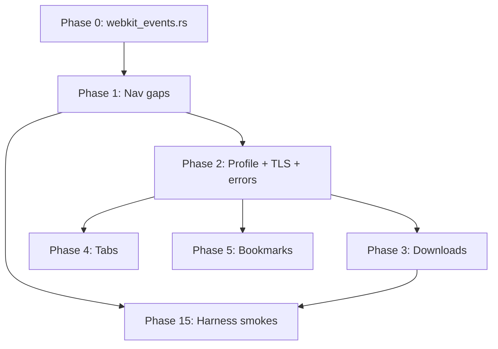

# Linux GTK + Wayland UI wiring plan

Mirrors the Windows team phased plan (`WebKitHost` callbacks → WinUI). On Linux the equivalent pipe is **WebKitGTK 6 signals** in `chrome/linux/src/ui/webkit_events.rs`, consumed by `WindowState` on the GTK main loop.

**Conformance:** [`features.yaml`](../features.yaml) row `platform:linux-gtk-wayland`  
**Harness:** [`harness_linux/`](../harness_linux/) — one AT-SPI smoke per feature id (same convention as [`harness_windows/README.md`](../harness_windows/README.md))  
**Build:** `WEBKIT_GTK_BUILD` → pinned WebKitGTK tree (never distro `libwebkitgtk`)

## Phase 0 — WebKitGTK event layer (blocks almost everything)

**Goal:** One event pipe from `WKWebView` → `webkit_events::attach_tab` → `WindowState` chrome updates.

| Windows (WebKitHost) | Linux (webkit6) |
|----------------------|-----------------|
| didStartProvisional / progress / didFinish / didFail | `connect_load_changed`, `connect_estimated_load_progress_notify`, `connect_load_failed` |
| WKPageStopLoading | `WebView::stop_loading()` |
| Title / URL (no polling) | `connect_title_notify`, URI from `load_changed` / `uri()` |
| Link hover | `connect_mouse_target_changed` → `HitTestResult::link_uri` |
| WKDownload | `WebContext::connect_download_started` + `decide_policy` download |
| Permission prompts | `connect_permission_request` → allow/deny + profile store |
| Favicon / audio | `connect_favicon_notify`, `connect_is_playing_audio_notify` |

**Deliverable:** `ui/webkit_events.rs` + `WindowState::on_*` handlers; no URL/title polling.

**Harness:** `test_engine_events.rs` (load progress moves, stop cancels load).

---

## Phase 1 — Required navigation gaps (5 features, all `required: true`)

| # | ID | Work |
|---|-----|------|
| 1 | `load_progress` | `estimated_load_progress` → header `ProgressBar` + optional tab hint |
| 2 | `reload_stop` | Stop → `stop_loading()`; reload → `reload()` |
| 3 | `hover_link_status` | `mouse_target_changed` → status `Label` |
| 4 | `find_on_page` | `FindController` (native, not injected JS) |
| 5 | `page_zoom` | `WebView::set_zoom_level` per tab |

**Harness:** `test_load_progress.rs`, `test_reload_stop.rs`, `test_hover_link.rs`, extend `test_find_on_page.rs`, `test_page_zoom.rs`.

---

## Phase 2 — Profile persistence & TLS chrome

| # | ID | Work |
|---|-----|------|
| 6 | Per-profile data store | `WEBKITIUM_PROFILE_DIR` → persistent `WebContext` / network session; private → ephemeral context |
| 7 | `url_secure_indicator` | Lock from `tls_info()` + `https://` committed URI, not prefix-only |
| 8 | Error pages | `load_failed` → tab label + status text (not silent blank) |

---

## Phase 3 — Downloads pipeline (3 required)

| # | ID | Work |
|---|-----|------|
| 9 | `download_to_disk` | `download-started` → XDG Downloads + `wk_downloads_*` |
| 10 | `downloads_list` | Live list from profile store |
| 11 | `cancel_download` | Cancel in-flight + store update |
| 12 | `show_download_in_finder` | `xdg-open` parent dir |
| 13 | `persist_downloads` | Store survives restart |

**Harness:** `test_downloads.rs`.

---

## Phase 4 — Tab polish

`duplicate_tab`, `pin_tab`, `close_other_tabs`, `mute_tab` (`set_is_muted`), `tab_overview`, `tab_groups` (FFI), `prewarm_tab` (hidden WebView), `sidebar_tab_count`.

---

## Phase 5 — Bookmarks & reading list

`reading_list`, `bookmarks_manager`, `new_bookmark_folder`, `url_inline_add_bookmark`, `history_keyboard_shortcut` (Ctrl+H). Verify `add_bookmark`, `list_bookmarks`, `history_view`, `clear_history` with harness.

---

## Phase 6 — URL bar intelligence

`url_reader_indicator`, `page_settings_menu` (zoom, desktop UA), `reader_mode` (WebKit reader when available).

---

## Phase 7 — Extensions

MSVC-safe ExtensionBridge on Windows; on Linux link `ng_browser_core` extensions FFI. `extensions_list` (required), runtime/toolbar/popover/store.

---

## Phase 8 — Site permissions (required)

`permission_request` + persistent rules in `profile/site_permissions.json` + settings UI.

---

## Phases 9–14

WebAuthn (`browser/webauthn/`), inspector dock, share (portal), PWA `.desktop`, sync/profiles, translation — same ordering as Windows plan.

---

## Phase 15 — Harness conformance (36 required smokes)

Every `required: true` row in `features.yaml` must have `harness_linux/tests/test_<id>.rs` with stable **AT-SPI labels** matching `Aria::Label(...)` in chrome.

Run:

```bash
./scripts/linux_build_and_test.sh
# or
cd harness_linux && cargo test -- --ignored
```

---

## Sprint order (mermaid)



## Verification checklist (agent / CI)

1. `export WEBKIT_GTK_BUILD=…` and `PKG_CONFIG_PATH=…`
2. `cd chrome/linux && cargo build --release`
3. `GDK_BACKEND=wayland WEBKITIUM_LAUNCH_URL=https://example.com ./target/release/webkitium` — manual smoke
4. `cd harness_linux && WEBKITIUM_BIN=… cargo test -- --ignored`
5. Update `platform:linux-gtk-wayland.implemented` only after harness green for that id
